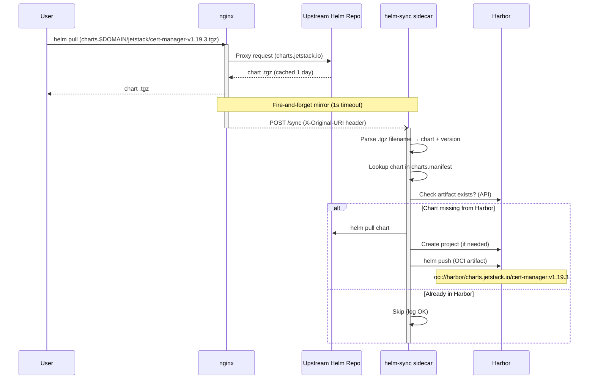
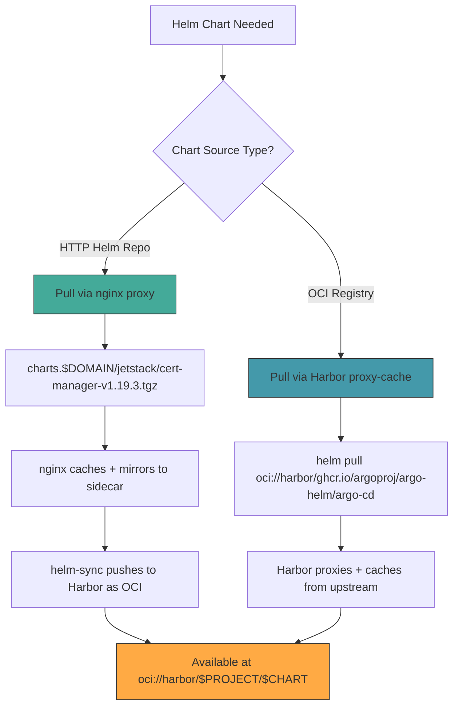
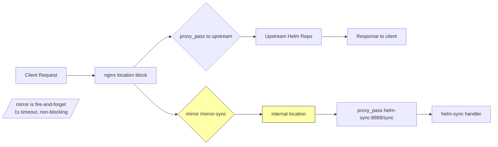

# Harvester Helm Harbor Sync

Nginx reverse proxy with automatic Helm chart synchronization to Harbor. Proxies upstream Helm HTTP repositories and automatically pushes downloaded charts to Harbor as OCI artifacts via a lightweight bash sidecar. Designed for air-gapped and semi-connected Kubernetes environments running on Harvester.

## Architecture

```
┌─────────────────┐     ┌──────────────────────────────────────────────┐
│   Client         │     │  Proxy VM (docker-compose)                   │
│                 │     │                                              │
│ helm repo add   │────▶│  nginx:443 (TLS termination + caching)       │
│ helm pull       │     │    yum.$DOMAIN   → Rocky/RKE2 RPMs          │
│ yum install     │     │    apt.$DOMAIN   → Debian/Ubuntu APT        │
│ curl ...        │     │    dl.$DOMAIN    → Cloud images (qcow2)     │
│                 │────▶│    charts.$DOMAIN → 11 Helm HTTP repos      │
│                 │     │      └── mirror ──▶ helm-sync:8888 (sidecar)│
│                 │     │                      └── push to Harbor OCI  │
│                 │     │    bin.$DOMAIN   → Static GitHub binaries    │
│                 │     │    harbor.$DOMAIN → Harbor TLS termination   │
│                 │────▶│  registry:5000                               │
│                 │     │    Bootstrap container images (Docker v2)     │
└─────────────────┘     └──────────────────────────────────────────────┘
```

## How It Works

### Helm Chart Sync Flow



### Two Paths for Helm Charts



### Request Lifecycle (nginx mirror)



## Prerequisites

- **Docker** with Compose plugin (v2)
- **openssl** for certificate generation
- **Harbor** instance (for OCI chart storage)
- A **root CA** certificate and key (for generating the proxy's intermediate CA)
- DNS or `/etc/hosts` entries pointing `*.$DOMAIN` to the proxy VM

## Quick Start

```bash
# 1. Clone and configure
git clone https://github.com/derhornspieler/harvester-helm-harbor-sync.git
cd harvester-helm-harbor-sync
cp .env.example .env
vi .env                            # Set your domain, Harbor creds, etc.

# 2. Generate random Harbor password (optional)
./scripts/generate-secrets.sh

# 3. Apply domain to nginx configs
./scripts/configure.sh

# 4. Generate TLS certificates
./certs/generate-certs.sh --domain "$(grep DOMAIN .env | cut -d= -f2)"

# 5. Add /etc/hosts entries (or configure DNS)
DOMAIN=$(grep DOMAIN .env | cut -d= -f2)
echo "127.0.0.1  yum.${DOMAIN} apt.${DOMAIN} dl.${DOMAIN} charts.${DOMAIN} bin.${DOMAIN} harbor.${DOMAIN}" \
  | sudo tee -a /etc/hosts

# 6. Trust the CA
sudo cp certs/ca-chain.pem /etc/pki/ca-trust/source/anchors/proxy-ca.pem
sudo update-ca-trust

# 7. Start services
docker compose up -d

# 8. Verify
./test.sh
```

## Deploy to a Remote VM

```bash
# Provision a dedicated proxy VM via SSH
./setup-proxy-vm.sh <proxy-vm-ip> --domain yourdomain.com --ssh-user rocky

# Or provision on Harvester via Terraform
cd terraform
cp terraform.tfvars.example terraform.tfvars
vi terraform.tfvars
terraform init && terraform apply
```

## Configuration

All settings live in `.env` (copy from `.env.example`):

| Variable | Description | Default |
|----------|-------------|---------|
| `DOMAIN` | Base domain for all proxy hostnames | `example.com` |
| `HARBOR_HOST` | Harbor registry hostname | `harbor.example.com` |
| `HARBOR_USER` | Harbor robot account username | `robot$helm-sync` |
| `HARBOR_PASS` | Harbor robot account password | _(required)_ |
| `HARBOR_BACKEND` | Harbor HTTP backend IP/host (for TLS termination) | `harbor-backend` |
| `PROXY_VM_IP` | Static IP for the proxy VM | `10.0.0.100` |
| `SSH_USER` | SSH user for VM provisioning | `rocky` |
| `PKI_DIR` | Path to root CA cert/key directory | `./pki` |
| `CERT_ORG` | Organization name for generated certificates | `Example Org` |

After changing `.env`, run `./scripts/configure.sh` to apply the domain to nginx configs.

## Directory Structure

```
.
├── .env.example                    # Configuration template
├── .github/workflows/ci.yml       # GitHub Actions CI pipeline
├── docker-compose.yaml             # Service definitions (nginx, helm-sync, registry)
├── README.md
│
├── nginx/                          # Reverse proxy configuration
│   ├── nginx.conf                  # Main config (resolver, log format, health check)
│   ├── conf.d/
│   │   ├── yum.conf                # Rocky Linux / EPEL / RKE2 RPM repos
│   │   ├── apt.conf                # Debian / Ubuntu APT repos
│   │   ├── dl.conf                 # Cloud images (qcow2, ISOs)
│   │   ├── charts.conf             # 11 Helm HTTP chart repos (with mirror)
│   │   ├── bin.conf                # Static binary files
│   │   └── harbor.conf             # Harbor TLS termination
│   └── includes/
│       ├── ssl-defaults.conf       # Shared TLS settings
│       ├── proxy-defaults.conf     # Shared proxy headers/timeouts
│       └── cache.conf              # Cache path declarations
│
├── helm-sync/                      # Helm-to-Harbor sync sidecar
│   ├── Dockerfile                  # Alpine + bash + helm + ncat
│   ├── entrypoint.sh               # CA cert installer
│   └── helm-sync.sh                # HTTP listener + sync logic
│
├── helm-oci/
│   ├── charts.manifest             # HTTP chart definitions (pipe-delimited)
│   └── sync-helm-oci.sh            # Batch sync script (manual/one-time)
│
├── registry/
│   ├── config.yml                  # Docker Distribution v2 config
│   └── populate-bootstrap-registry.sh
│
├── certs/
│   └── generate-certs.sh           # Intermediate CA + multi-SAN leaf cert
│
├── bin/
│   └── fetch-binaries.sh           # Pre-download GitHub release binaries
│
├── scripts/
│   ├── configure.sh                # Apply .env settings to config files
│   └── generate-secrets.sh         # Generate random credentials
│
├── terraform/                      # Harvester VM provisioning (optional)
│   ├── main.tf                     # Cloud-init + VM resource
│   ├── variables.tf                # Input variables
│   ├── outputs.tf                  # VM IP, hostnames, /etc/hosts entry
│   ├── versions.tf                 # Provider requirements
│   ├── providers.tf                # Harvester provider config
│   └── fetch-providers.sh          # Download providers for offline use
│
├── env/
│   └── airgap.env.example          # Full .env template for AIRGAPPED=true deployments
│
├── setup-proxy-vm.sh               # Provision remote VM via SSH
└── test.sh                         # End-to-end verification (24 tests)
```

## Components

### nginx (Reverse Proxy)

Six virtual hosts behind TLS, all sharing the same wildcard certificate:

| Virtual Host | Upstream | Cache |
|-------------|----------|-------|
| `yum.$DOMAIN` | Rocky 9 BaseOS/AppStream/CRB, EPEL 9, RKE2 RPMs | 20 GB, 7-day TTL |
| `apt.$DOMAIN` | Debian bookworm, Ubuntu noble + security repos | 20 GB, 7-day TTL |
| `dl.$DOMAIN` | Rocky 9 cloud images (qcow2) | 30 GB, 30-day TTL |
| `charts.$DOMAIN` | 11 Helm HTTP chart repos (see below) | 2 GB, 1-day TTL |
| `bin.$DOMAIN` | Pre-downloaded GitHub release binaries (static) | Client-side only |
| `harbor.$DOMAIN` | Harbor HTTP backend → TLS termination | No cache |

### helm-sync (Sidecar)

Lightweight bash HTTP server using `ncat`. Listens on port 8888.

| Endpoint | Method | Purpose |
|----------|--------|---------|
| `/sync` | GET | Called by nginx mirror — parses `X-Original-URI`, syncs to Harbor |
| `/sync-all` | GET | Trigger full sync of all charts in manifest |
| `/healthz` | GET | Health check |

**How the mirror works:**
- Each `charts.conf` location block has `mirror /mirror-sync; mirror_request_body off;`
- `/mirror-sync` is an `internal` location that proxies to `helm-sync:8888/sync`
- Timeouts are 1s — nginx never blocks waiting for the sidecar
- The sidecar runs `sync_chart()` in the background (`&`) so ncat can accept the next connection

### Proxied Helm Chart Repos

| Location Path | Upstream | Chart |
|--------------|----------|-------|
| `/jetstack/` | charts.jetstack.io | cert-manager |
| `/cnpg/` | cloudnative-pg.github.io/charts | cloudnative-pg |
| `/hashicorp/` | helm.releases.hashicorp.com | vault |
| `/goharbor/` | helm.goharbor.io | harbor |
| `/prometheus-community/` | prometheus-community.github.io/helm-charts | kube-prometheus-stack |
| `/external-secrets/` | external-secrets.io | external-secrets |
| `/autoscaler/` | kubernetes.github.io/autoscaler | cluster-autoscaler |
| `/ot-helm/` | ot-container-kit.github.io/helm-charts | redis-operator |
| `/kasmtech/` | helm.kasmweb.com | kasm |
| `/gitlab/` | charts.gitlab.io | gitlab-runner |
| `/mariadb-operator/` | mariadb-operator.github.io/mariadb-operator | mariadb-operator |

## Adding a New HTTP Helm Chart

1. **Add to `helm-oci/charts.manifest`:**

   ```
   http|https://new-repo.example.io|1.2.3|new-repo.example.io|chart-name|HELM_OCI_CHART_NAME
   ```

   Format: `TYPE|SOURCE|VERSION|HARBOR_PROJECT|CHART_NAME|ENV_VAR`

2. **Add nginx location block** in `nginx/conf.d/charts.conf`:

   ```nginx
   # chart-name
   location /new-repo/ {
       mirror /mirror-sync;
       mirror_request_body off;
       proxy_pass https://new-repo.example.io/;
       include /etc/nginx/includes/proxy-defaults.conf;
       proxy_cache charts_cache;
       proxy_cache_valid 200 1d;
       proxy_cache_valid 404 1m;
       proxy_cache_use_stale error timeout updating;
       add_header X-Cache-Status $upstream_cache_status;
   }
   ```

3. **Restart nginx:**

   ```bash
   docker compose restart nginx
   ```

4. **Test:**

   ```bash
   helm repo add new-repo https://charts.$DOMAIN/new-repo
   helm pull new-repo/chart-name --version 1.2.3
   ```

   The sidecar will automatically push it to Harbor as `oci://$HARBOR_HOST/new-repo.example.io/chart-name:1.2.3`.

## Adding a New OCI Registry (Harbor Proxy-Cache)

OCI-native charts (ghcr.io, docker.io, quay.io, etc.) don't need the sidecar. Harbor's built-in proxy-cache handles them natively.

1. **Create a registry endpoint in Harbor:**

   ```bash
   curl -X POST "https://${HARBOR_HOST}/api/v2.0/registries" \
     -H "Content-Type: application/json" \
     -u "admin:${HARBOR_ADMIN_PASS}" \
     -d '{
       "name": "new-registry.io",
       "type": "docker-registry",
       "url": "https://new-registry.io"
     }'
   ```

2. **Create a proxy-cache project:**

   ```bash
   # Get the registry ID from step 1
   REGISTRY_ID=$(curl -s "https://${HARBOR_HOST}/api/v2.0/registries" \
     -u "admin:${HARBOR_ADMIN_PASS}" | jq '.[] | select(.name=="new-registry.io") | .id')

   curl -X POST "https://${HARBOR_HOST}/api/v2.0/projects" \
     -H "Content-Type: application/json" \
     -u "admin:${HARBOR_ADMIN_PASS}" \
     -d "{
       \"project_name\": \"new-registry.io\",
       \"public\": true,
       \"registry_id\": ${REGISTRY_ID}
     }"
   ```

3. **Pull charts through Harbor:**

   ```bash
   helm pull oci://${HARBOR_HOST}/new-registry.io/org/chart-name --version 1.0.0
   ```

**Common registries already configured as proxy-cache in most Harbor instances:**
`ghcr.io`, `docker.io`, `gcr.io`, `quay.io`, `registry.k8s.io`, `public.ecr.aws`

## Harbor Robot Account Setup

The helm-sync sidecar needs a Harbor robot account with permissions to create projects and push charts.

```bash
curl -X POST "https://${HARBOR_HOST}/api/v2.0/robots" \
  -H "Content-Type: application/json" \
  -u "admin:${HARBOR_ADMIN_PASS}" \
  -d '{
    "name": "helm-sync",
    "level": "system",
    "permissions": [{
      "kind": "system",
      "namespace": "*",
      "access": [
        {"resource": "project", "action": "create"},
        {"resource": "repository", "action": "push"},
        {"resource": "repository", "action": "pull"},
        {"resource": "artifact", "action": "read"},
        {"resource": "artifact", "action": "list"},
        {"resource": "tag", "action": "create"},
        {"resource": "tag", "action": "list"}
      ]
    }]
  }'
```

Save the returned `secret` as `HARBOR_PASS` in your `.env`. The username will be `robot$helm-sync`.

## Certificate Chain

```
Root CA (offline, long-lived)
└── Proxy Intermediate CA (5yr, RSA-4096, pathlen:0)
    └── *.$DOMAIN leaf (1yr, ECDSA P-256)
        SANs: yum, apt, dl, charts, bin, harbor
```

The CA chain (`certs/ca-chain.pem`) must be trusted by all clients. For Kubernetes nodes, inject it via cloud-init or distribute it as part of your node provisioning.

```bash
# Generate certificates
./certs/generate-certs.sh --pki-dir /path/to/pki --domain yourdomain.com

# Trust on RHEL/Rocky
sudo cp certs/ca-chain.pem /etc/pki/ca-trust/source/anchors/proxy-ca.pem
sudo update-ca-trust

# Trust on Debian/Ubuntu
sudo cp certs/ca-chain.pem /usr/local/share/ca-certificates/proxy-ca.crt
sudo update-ca-certificates
```

## Caching

All caches use named Docker volumes for persistence across container restarts.

| Cache | Size Limit | TTL | Inactive Eviction | Volume |
|-------|-----------|-----|-------------------|--------|
| RPM/APT | 20 GB | 7 days | 30 days | `nginx-cache-rpm` |
| Helm charts | 2 GB | 1 day | 1 day | `nginx-cache-charts` |
| Cloud images | 30 GB | 30 days | 30 days | `nginx-cache-downloads` |
| Container images | Unlimited | — | — | `registry-data` |

## Troubleshooting

### helm-sync not pushing to Harbor

Check the sidecar logs:

```bash
docker exec helm-sync cat /var/log/helm-sync/sync.log
```

Common issues:
- **`HARBOR_HOST must be set`** — Missing `.env` or env vars not loaded
- **`Harbor registry login failed`** — Wrong credentials or Harbor unreachable
- **`Chart not in manifest`** — Chart name doesn't match any entry in `charts.manifest`
- **`Failed to pull`** — Upstream repo unreachable or chart version doesn't exist

### nginx returns 502/504 for chart repos

```bash
# Check nginx can resolve upstream hostnames
docker exec airgap-nginx nslookup charts.jetstack.io

# Check nginx error logs
docker logs airgap-nginx --tail 50
```

### Trigger a full sync manually

```bash
curl http://localhost:8888/sync-all
# Or from outside the container:
docker exec helm-sync wget -qO- http://127.0.0.1:8888/sync-all
```

### Verify a chart exists in Harbor

```bash
curl -s "https://${HARBOR_HOST}/api/v2.0/projects/charts.jetstack.io/repositories/cert-manager/artifacts" \
  -u "${HARBOR_USER}:${HARBOR_PASS}" | jq '.[].tags[].name'
```

### Clear nginx cache

```bash
docker compose down
docker volume rm harvester-helm-harbor-sync_nginx-cache-charts
docker compose up -d
```

## CI

GitHub Actions runs on every push and pull request:

| Job | Tool | What it checks |
|-----|------|---------------|
| `lint` | ShellCheck | All `.sh` scripts for bugs and portability |
| `lint` | Hadolint | Dockerfile best practices |
| `lint` | yamllint | YAML syntax (docker-compose, registry config) |
| `nginx-config` | `nginx -t` | nginx configuration syntax |
| `docker-compose` | `docker compose config` | Compose file validity |
| `secrets-scan` | Gitleaks | No secrets in commit history |

## License

MIT
